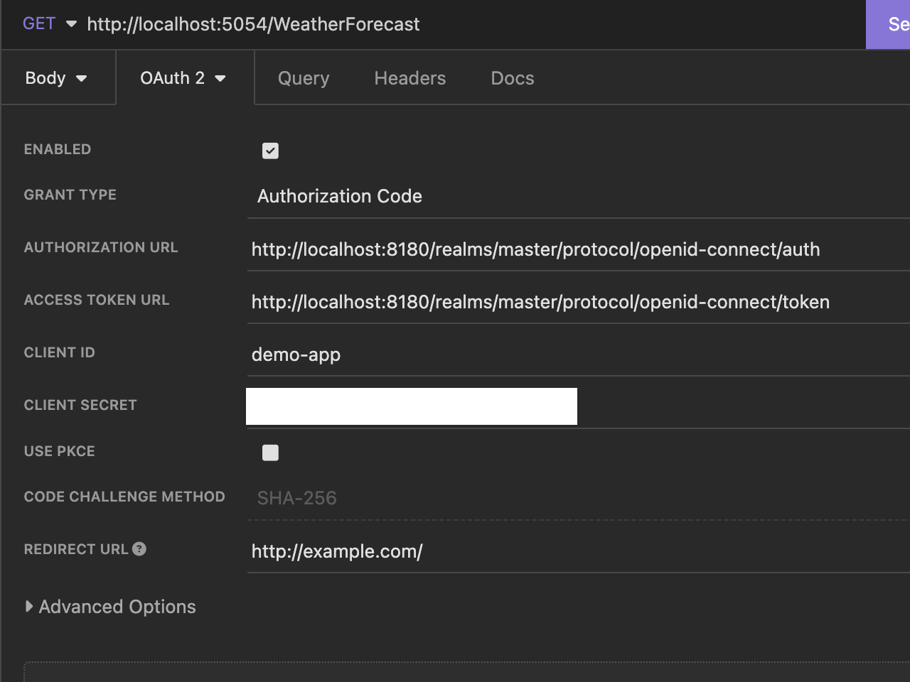

## Keycloak Local Development Setup

**NB:** This is *not* intended for use beyond a local dev environment.

```shell
docker compose up
```

Keycloak will be available at http://localhost:8180

### Create a client

- Configure > Clients
- Click the `Create` button
  - Set `Client ID` to `demo-app`
  - Pick `OIDC` as the Client Protocol
  - Optional: set `Access Type` to `Confidential` to use a secret in the flow
  - Set a valid redirect URI (`http://example.com/` works)
  - Set `Base URL` (the URL of the app when run locally works, e.g. `http://localhost:5054`)
  - Add an `Audience Mapper` and include the `demo-app` audience.

### Verify token setup

- Get a token. The following is an example from Insomnia

- Using the token in the `Authorization` header `Bearer <token>`, call `GET http://localhost:5054/WeatherForecast`

### Test anonymous end point

- `GET http://localhost:5054/WeatherForecast/NoAuth`

### Use Envoy to validate in lieu of .NET code

*This has the advantage of moving a concern that can change out to config (i.e. the app itself doen't need updated or redeployed)*

- `./start-envoy.sh` # listens on 9999
- `GET http://localhost:9999/WeatherForecast/NoAuth`